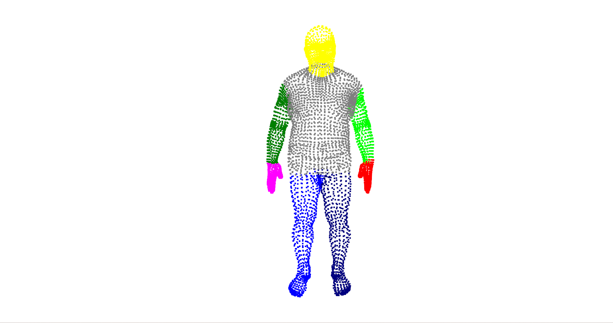
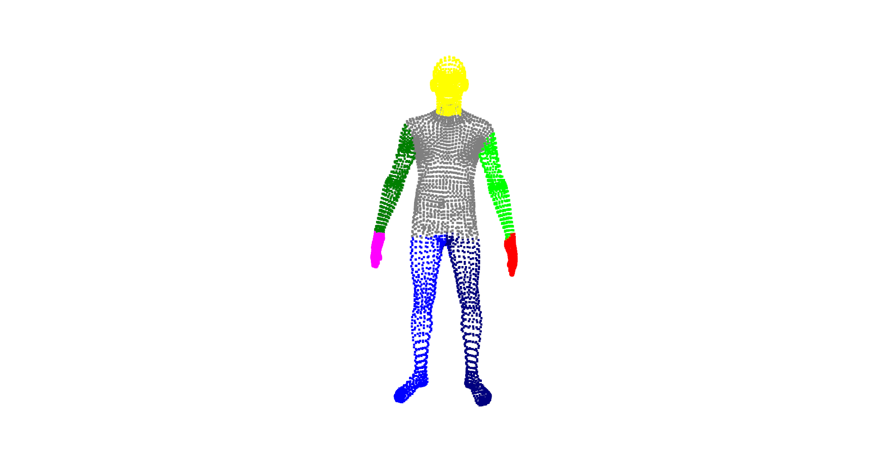
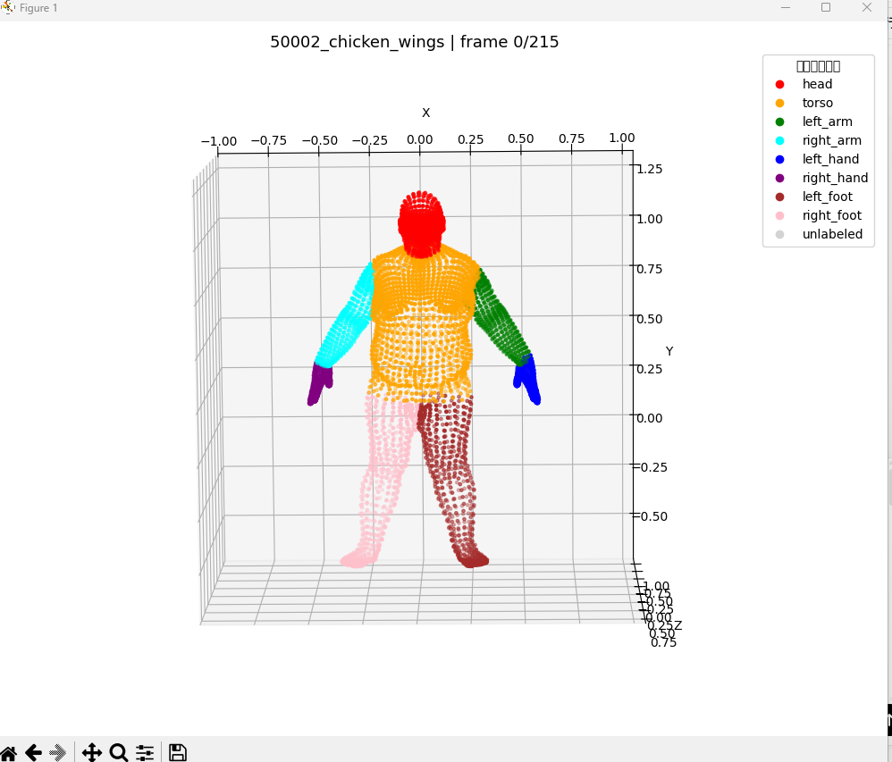
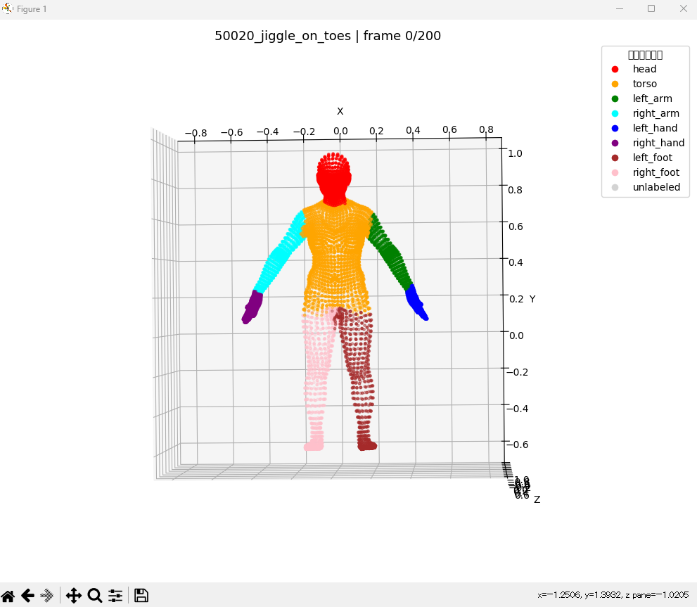

# Human Point Cloud Part Segmentation Dataset Pipeline

## Language / 言語

- [日本語](#日本語)
- [English](#english)

---

<a id="日本語"></a>

# 日本語

# 人体点群部位分割データセット作成パイプライン

本リポジトリは、DFAUST/FAUST 形式の registered human mesh data を用いて、人体点群の部位分割用データセットを作成するための処理パイプラインをまとめたものです。

主な目的は、人体点群に対して頂点レベルの身体部位ラベルを作成し、PointNet、PointNet++、DGCNN などの深層学習ベースの点群セグメンテーションモデルに利用できる形式へ整備することです。

---

## 概要

本プロジェクトでは、以下の処理を行います。

- DFAUST/FAUST の HDF5 registration file の読み込み
- HDF5 データセット内部構造の確認
- 頂点 index に基づく身体部位ラベルの定義
- 各点が正しい身体部位に割り当てられているかの可視化確認
- 点群セグメンテーション用サンプルの生成
- 点群セグメンテーションモデル用データの準備

生成されるデータ形式は以下の通りです。

```text
points: (6890, 3)
labels: (6890,)
```

---

## 重要な注意事項

DFAUST/FAUST のライセンス制限により、元の HDF5 ファイルおよび生成済みの完全な分割データセットは、この公開リポジトリには含めていません。

本リポジトリで公開しているものは以下のみです。

- 公開用の前処理スクリプト
- 身体部位 index のテンプレートまたは公開用バージョン
- 検証用スクリプト
- 可視化例
- データセット作成プロセスの説明

元データファイルはローカル環境で準備し、GitHub にはアップロードしません。

---

## リポジトリ構成

```text
human-pointcloud-segmentation-dataset/
├── README.md
├── .gitignore
├── data/
│   └── .gitkeep
├── process_data/
│   ├── make_dfaust_part_dataset_public.py
│   ├── part_indices.py
│   ├── test_data_set.py
│   └── test_part_indices.py
└── figures/
    ├── 1.png
    ├── 2.png
    ├── 3.png
    └── 4.png
```

---

## data ディレクトリについて

`data/` ディレクトリはローカル環境でのみ使用します。

想定されるローカル構成は以下の通りです。

```text
data/
├── registrations_f.hdf5
├── registrations_m.hdf5
└── DFAUST_PART_SEG_ALL/
```

各ファイル・ディレクトリの意味は以下の通りです。

- `registrations_f.hdf5`: 女性人体の registered mesh data
- `registrations_m.hdf5`: 男性人体の registered mesh data
- `DFAUST_PART_SEG_ALL/`: 生成済みの部位分割用データセット

これらのファイルは本リポジトリには含めていません。

---

## 身体部位ラベルの定義

身体部位ラベルは、頂点 index 辞書を用いて定義しています。

各頂点 index は、以下のような意味的な身体部位に割り当てられます。

- head
- torso
- left arm
- right arm
- left hand
- right hand
- left foot
- right foot

頂点レベルの身体部位 index 辞書を定義することで、生成されたラベルは PointNet、PointNet++、DGCNN などの異なる点群セグメンテーションモデルに共通の ground-truth annotation として利用できます。

---

## 身体部位ラベルの可視化

以下の図は、手動で定義した身体部位 index 辞書を用いた可視化結果です。

これらの画像はモデルの推論結果ではありません。  
各頂点 index が対応する身体部位に正しく割り当てられているかを確認するためのものです。

### Example 1



### Example 2



### Example 3



### Example 4



これらの可視化結果により、手動で定義した頂点 index 辞書が各点を意味的な身体部位に割り当てられることを確認できます。

---

## 処理パイプライン

全体の処理手順は以下の通りです。

1. DFAUST/FAUST の HDF5 registration data を読み込む
2. データセット内部構造を確認する
3. 身体部位 index mapping を定義する
4. 身体部位 index に重複がないか確認する
5. 各頂点に意味的ラベルを割り当てる
6. ラベル付き点群を可視化する
7. セグメンテーション用サンプルを生成する
8. 処理済みデータセットをローカルに保存する

---

## スクリプト

### 1. HDF5 構造の確認

`test_data_set` は、HDF5 ファイル内部構造を確認するためのスクリプトです。

実行例：

```bash
python process_data/test_data_set --h5-path data/registrations_f.hdf5
```

このスクリプトでは、HDF5 ファイル内のデータセット名、shape、データ型を表示します。

---

### 2. 身体部位 index 辞書の検証

`test_part_indices` は、身体部位 index 辞書が人体点群を正しい部位に分割できているかを可視化するためのスクリプトです。

実行例：

```bash
python process_data/test_part_indices \
  --h5-path data/registrations_f.hdf5 \
  --sid 50020 \
  --seq jiggle_on_toes \
  --frame-id 0
```

主に以下を確認します。

- 各身体部位が正しく割り当てられているか
- 異なる身体部位の index が重複していないか
- 未ラベルの点が存在するか
- 可視化結果が妥当か

---

### 3. 部位分割用データセットの生成

`make_dfaust_part_dataset_public` は、ローカル環境で点群部位分割用サンプルを生成するためのスクリプトです。

実行例：

```bash
python process_data/make_dfaust_part_dataset_public \
  --male-h5 data/registrations_m.hdf5 \
  --female-h5 data/registrations_f.hdf5 \
  --save-root data/DFAUST_PART_SEG_ALL
```

生成されたデータセットは以下に保存されます。

```text
data/DFAUST_PART_SEG_ALL/
```

生成済みの完全なデータセットは GitHub にはアップロードしません。

---

## 対象モデル

生成されたラベルは、以下のような点群セグメンテーションモデルの学習・評価に利用できます。

- PointNet
- PointNet++
- DGCNN

本プロジェクトでは、モデル学習前のデータセット作成とラベル検証に重点を置いています。

---

## 評価予定

データセット作成後、以下の指標を用いてセグメンテーション性能を評価する予定です。

- Overall Accuracy
- Mean IoU
- Per-part IoU
- 欠損点群条件下での頑健性

---

## ライセンスに関する注意

元の DFAUST/FAUST データセットは、それぞれのライセンス条件に従います。

本リポジトリでは、元データセットおよび生成済みの完全なデータセットを再配布していません。  
公開しているのは、スクリプト、説明資料、可視化例のみです。


---

<a id="english"></a>

# English

# Human Point Cloud Part Segmentation Dataset Pipeline

This repository presents a data preparation pipeline for human point cloud part segmentation based on DFAUST/FAUST-style registered human mesh data.

The main goal of this project is to construct vertex-level body-part labels for human point clouds and prepare the data for deep learning-based point cloud segmentation models such as PointNet, PointNet++, and DGCNN.

---

## Overview

This project focuses on the following tasks:

- Reading DFAUST/FAUST HDF5 registration files
- Checking the internal structure of the HDF5 dataset
- Defining body-part labels using vertex index mappings
- Visualizing whether each point is correctly assigned to a human body part
- Generating point cloud segmentation samples
- Preparing data for point cloud segmentation models

The generated data format is designed for semantic part segmentation:

```text
points: (6890, 3)
labels: (6890,)
```

---

## Important Note

Due to the license restrictions of DFAUST/FAUST, the original HDF5 files and the generated full segmentation dataset are not included in this public repository.

This repository only provides:

- Public preprocessing scripts
- A body-part index template or public version
- Validation scripts
- Visualization examples
- Documentation of the dataset construction process

The original data files should be prepared locally and should not be uploaded to GitHub.

---

## Repository Structure

```text
human-pointcloud-segmentation-dataset/
├── README.md
├── README_en.md
├── README_ja.md
├── .gitignore
├── data/
│   └── .gitkeep
├── process_data/
│   ├── make_dfaust_part_dataset_public
│   ├── part_indices
│   ├── test_data_set
│   └── test_part_indices
└── figures/
    ├── 1.png
    ├── 2.png
    ├── 3.png
    └── 4.png
```

---

## Data Directory

The `data/` directory is used only in the local environment.

Expected local structure:

```text
data/
├── registrations_f.hdf5
├── registrations_m.hdf5
└── DFAUST_PART_SEG_ALL/
```

Explanation:

- `registrations_f.hdf5`: registered female human mesh data
- `registrations_m.hdf5`: registered male human mesh data
- `DFAUST_PART_SEG_ALL/`: generated part-segmentation dataset

These files are not included in this repository.

---

## Body-Part Label Definition

The body-part labels are defined using a vertex index dictionary.

Each vertex index is assigned to one semantic body part, such as:

- head
- torso
- left arm
- right arm
- left hand
- right hand
- left foot
- right foot

Once the vertex-level body-part dictionary is defined, the generated labels can be used as common ground-truth annotations for different point cloud segmentation models.

---

## Visualization of Body-Part Label Mapping

The following figures show visualization results of the manually defined body-part index dictionary.

These images are not model prediction results.  
They are used to verify whether each vertex index is correctly assigned to the corresponding human body part.

### Example 1


### Example 2


### Example 3


### Example 4


These visualizations confirm that the manually defined vertex-index dictionary can assign each point to a semantic human body part.

---

## Processing Pipeline

The overall processing pipeline is as follows:

1. Load DFAUST/FAUST HDF5 registration data
2. Check the internal dataset structure
3. Define body-part index mappings
4. Validate whether body-part indices overlap
5. Assign semantic labels to each vertex
6. Visualize the labeled point cloud
7. Generate segmentation samples
8. Save the processed dataset locally

---

## Scripts

### 1. View HDF5 Structure

`test_data_set` is used to check the internal structure of the HDF5 file.

Example:

```bash
python process_data/test_data_set --h5-path data/registrations_f.hdf5
```

This script prints dataset names, shapes, and data types inside the HDF5 file.

---

### 2. Validate Body-Part Index Dictionary

`test_part_indices` is used to visualize whether the body-part index dictionary correctly separates the human point cloud into different body regions.

Example:

```bash
python process_data/test_part_indices \
  --h5-path data/registrations_f.hdf5 \
  --sid 50020 \
  --seq jiggle_on_toes \
  --frame-id 0
```

This script is mainly used for checking:

- whether each body part is correctly assigned
- whether different body parts overlap
- whether unlabeled points exist
- whether the visualization looks reasonable

---

### 3. Generate Part-Segmentation Dataset

`make_dfaust_part_dataset_public` is used to generate local point cloud part-segmentation samples.

Example:

```bash
python process_data/make_dfaust_part_dataset_public \
  --male-h5 data/registrations_m.hdf5 \
  --female-h5 data/registrations_f.hdf5 \
  --save-root data/DFAUST_PART_SEG_ALL
```

The generated dataset will be saved locally under:

```text
data/DFAUST_PART_SEG_ALL/
```

The generated full dataset is not uploaded to GitHub.

---

## Target Models

The generated labels can be used for training and evaluating point cloud segmentation networks such as:

- PointNet
- PointNet++
- DGCNN

This project focuses on dataset preparation and label validation before model training.

---

## Evaluation Plan

After preparing the dataset, segmentation performance can be evaluated using:

- Overall Accuracy
- Mean IoU
- Per-part IoU
- Robustness under incomplete point cloud conditions

---

## License Notice

The original DFAUST/FAUST dataset is subject to its own license terms.

This repository does not redistribute the original dataset or the generated full dataset.  
Only scripts, documentation, and visualization examples are provided.

